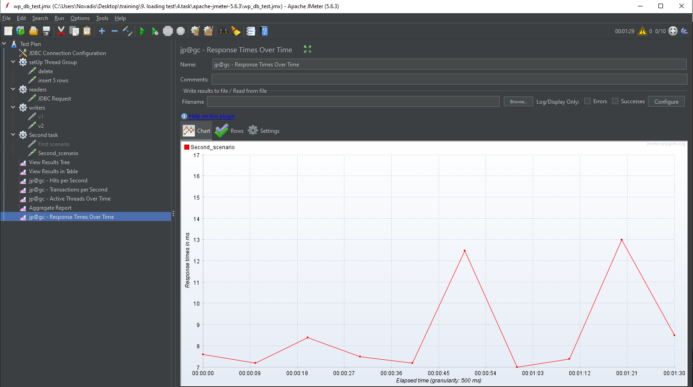
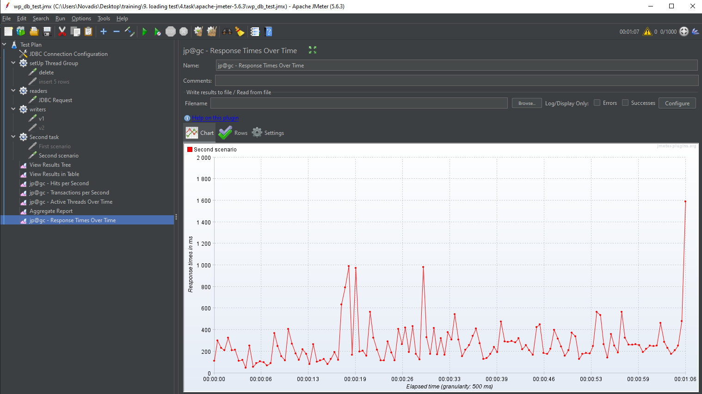

  * [Отчет тестировщика о состоянии проекта](#отчет-тестировщика-о-состоянии-проекта)
  * [Цель тестирования](#цель-тестирования)
  * [Конфигурация стенда](#конфигурация-стенда)
  * [Сценарий тестирования](#сценарий-тестирования)
  * [Графики](#графики)
  * [Результаты](#результаты)
  * [Найденные в процессе дефекты](#найденные-в-процессе-дефекты)
  * [Трудоемкость](#трудоемкость)
  * [Календарная длительность](#календарная-длительность)
  * [Выводы](#выводы)
<!-- TOC -->
## Отчет тестировщика о состоянии проекта
### ФИО
 - Иванов Иван Иванович
### Дата:
 - 16 июля 2024
### Название проекта:
 - Cервис wordpress
### ID заявки на тестирование:
 - 123456
### ID фичи:
 - 78910
### Номер версии релизной сборки:
 - 1.0.0

## Цель тестирования
    Цель тестирования заключается в подтверждении заявленной
    производительности сервиса wordpress, а также в
    определении его максимальной производительности. Требования к
    производительности включают возможность обработки до 100 единовременно,
    время обработки до 20 секунд; Точка отказа ожидается на 10_000 
    комментариев в секунду. 

## Конфигурация стенда
 - Серверы: 1 сервера
 - Ядра процессора: 4 ядер на сервер
 - Память: 1 GB RAM на сервер
 - Операционная система: Ubuntu 20.04 LTS
 - Вспомогательное ПО Nginx, PostgreSQL, Node.js

## Сценарий тестирования
    Тестирование было выполнено с использованием JMeter для симуляции
    нагрузки. В сценарии тестирования предусматривались следующие шаги:
     - Выбор статьи
     - Сделать комментария 
     - Ввести имя пользователя и почту
     - Поддтвердить создание комментария
    Во время тестирования особое внимание уделялось времени отклика
    страниц и стабильности системы при высокой нагрузке.

## Графики
### Нагрузка при внесении 100 комментариев в одну секунду

### Нагрузка при внесении 100 комментариев в одну секунду в течении 100 секунд

### Нагрузка при внесении 10_000 комментариев в секунду

## Результаты
    Графики показали следующие результаты:
     - При вводе 100 комментариев единовременно - все комментарии вносятся корректно,
    примерно 15 запросов в секунду, задержка до появления последнего комментария составляет до 10 секунд.
     - При вводе 100 комментариев ежесекундно, в течении 100 секунд - все комментарии
    аносятся корректно, количество запросо поднимается до 45 в секунду.
     - При вводе 10_000 запросов в секунду - тест падает, комментарии не добавляются.
    Падение начинается примерно с 1000 запросов в секунду.

## Найденные в процессе дефекты

 - Блокирование внесения комментариев начинается примерно с 1000 запросов в секунду.
 - При большом количестве внесений комментариев единовременно, задержка до момента появления последнего комментария может быть долгой - до 10 секунд и выше.
 - В случае блокирования внесения комментариев, уже написанные комментарии висящие в процессе добавления - не добавляются и не сохраняются.

## Трудоемкость

### Фамилия, Кол-во дней:
 - Иванов, 1 день
 - 
## Календарная длительность
 - Задача выполнена за 1 день
 - 
## Выводы
 - Заявленная производительность подтверждена, система
   обеспечивает такую производительность
 - Предложение: Стоит рассмотреть вариант сохранения шаблона комментария в кэше у пользователя, дабы он не потерял уже внесенные данные.
